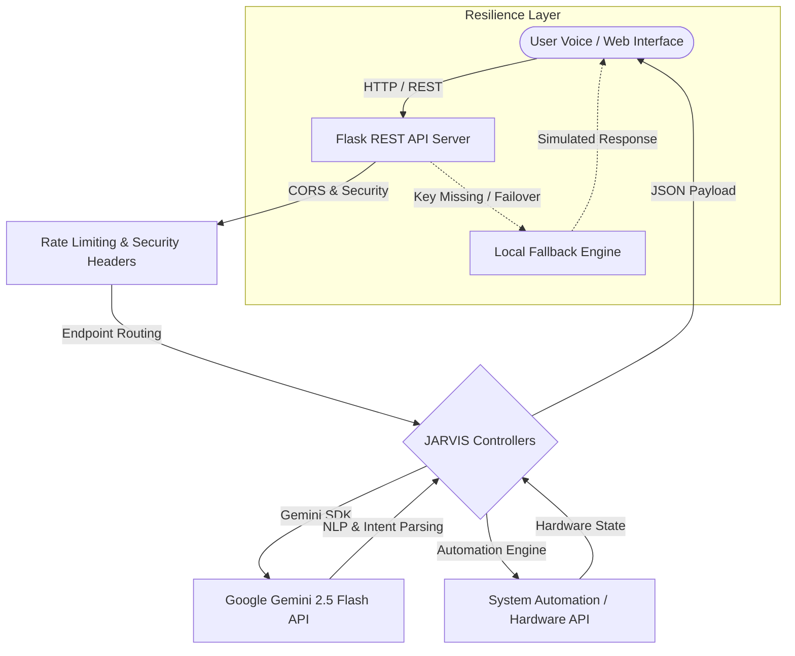

# 🤖 JARVIS AI Assistant - Next-Gen Autonomous Assistant

[](https://github.com/Avinashb722/jarvis-ai-assistant/actions)
[](https://ai.google.dev/)
[](https://www.python.org/)
[](LICENSE)

**JARVIS AI Assistant** is an advanced, multi-modal autonomous virtual assistant featuring voice recognition, facial biometric authentication, phone integration, system control, and real-time natural language reasoning powered by Google Gemini 2.5 Flash (`google-genai`).

---

## 🏗 System Architecture



---

## ⚡ Key Features

- 🧠 **Google Gemini 2.5 Flash**: Powered by the official `google-genai` Python SDK for fast, intelligent conversation processing.
- 🌐 **RESTful Server Infrastructure**: Production-grade Flask backend serving `/api/gemini/ask` and `/api/health`.
- 🔐 **Biometric & Facial Authentication**: OpenCV-powered face authentication and ADB fingerprint verification capabilities.
- 🔒 **Security Hardened**: Rate limiting headers (`X-RateLimit-*`), CORS configuration, and fallback mechanisms.
- 🗣️ **Voice & System Automation**: Voice command execution, speech-to-text, text-to-speech, and application control.
- 🧪 **Automated Testing**: Comprehensive pytest suite covering all backend endpoints.

---

## ⚙️ Environment Variables

Create a `.env` file in the project root:

```env
PORT=5000
FLASK_ENV=development
GEMINI_API_KEY=your_google_gemini_api_key_here
GROQ_API_KEY=your_groq_api_key_optional
```

---

## 🚀 Quick Setup & Installation

### Prerequisites
- **Python**: `3.10` or `3.11`
- **pip**: Latest version

### Steps

1. **Clone the Repository**
   ```bash
   git clone https://github.com/Avinashb722/jarvis-ai-assistant.git
   cd jarvis-ai-assistant
   ```

2. **Create & Activate Virtual Environment**
   ```bash
   python -m venv venv
   # On Windows:
   venv\Scripts\activate
   # On Linux/macOS:
   source venv/bin/activate
   ```

3. **Install Dependencies**
   ```bash
   pip install -r requirements.txt
   ```

4. **Start the API Backend Server**
   ```bash
   python server.py
   ```
   The API will start running on `http://localhost:5000`.

---

## 📡 API Reference

### Health Check
- **GET** `/api/health`
- **Response**:
  ```json
  {
    "status": "ok",
    "service": "jarvis-ai-assistant",
    "timestamp": "2026-08-12T12:00:00Z",
    "version": "1.0.0",
    "geminiConfigured": true
  }
  ```

### Ask Gemini AI Agent
- **POST** `/api/gemini/ask`
- **Headers**: `Content-Type: application/json`
- **Body**:
  ```json
  {
    "prompt": "JARVIS, summarize my daily schedule and suggest top priorities.",
    "model": "gemini-2.5-flash"
  }
  ```
- **Response**:
  ```json
  {
    "success": true,
    "response": "Here are your key priorities for today...",
    "fallback": false,
    "model": "gemini-2.5-flash"
  }
  ```

### JARVIS Command Execution
- **POST** `/api/jarvis/command`
- **Body**:
  ```json
  {
    "command": "open spotify"
  }
  ```

---

## 🧪 Testing Guide

Run the pytest test suite:

```bash
# Run pytest tests
pytest tests/
```

---

## 📄 License

This project is open-source software licensed under the [MIT License](LICENSE).
